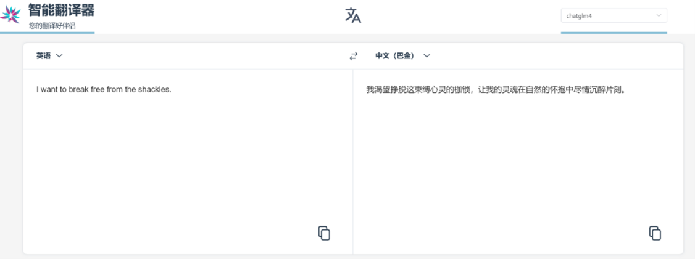
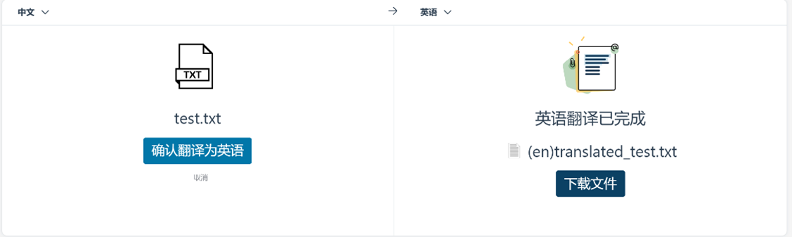

# 我最爱翻译了

## 简介

我最爱翻译了是一个利用先进的大语言模型和 langchain 技术实现的翻译应用，旨在为您提供高质量的文本翻译、文档翻译和独特的文风转换功能。无论您是需要将文档从一种语言翻译成另一种，还是希望改变文本的语气和风格，我最爱翻译了都能轻松应对。

## 主要功能

文本翻译：支持多种语言之间的文本翻译，让跨语言交流变得简单自然。  
文档翻译：不仅可以翻译简单的文本，还支持整个文档的翻译，保持原文档的格式和结构。  
文风转换：独特的文风转换功能，可以让您的文本在不同的语境和风格之间自如切换，满足多样化的写作需求。  

## 技术栈和模型

大语言模型：应用采用了最新的深度学习技术，确保翻译的准确性和流畅性。  
langchain：集成了 langchain 技术，提供高效的文本处理和转换能力。  

## 安装和使用

### 后端服务部署

1.克隆仓库到本地:
```
git clone https://github.com/NelbyCin/llm_translator.git
cd llm_translator
```
2.创建虚拟环境（推荐）:
```
python -m venv venv
source venv/bin/activate  # 在 Windows 上使用 `venv\Scripts\activate`
```
3.安装依赖:
```
pip install -r requirements.txt
```
4.下载向量库和数据集:
向量库：  
链接：https://pan.baidu.com/s/1MlJu6hT_86qRLne-LkFTBg?pwd=xre7   
提取码：xre7   
机器翻译数据集:  
链接：https://pan.baidu.com/s/1z5dMsxfj7Q2ljc0B9qONCg?pwd=xqg0   
提取码：xqg0   
放置于./api目录中  
5.配置config.json:  
于api/config.json中填写你使用大模型的url和api_key  
6.运行api服务器:
```
python translate_api.py
```

### 前端服务部署  
1. 切换到本项目的 `./web` 路径下，运行
```sh
npm install
```
安装web部署所需要的依赖项（确保您已经事先安装了node.js）

2. 在安装完毕之后，修改相关代码中的后端请求地址，随后运行
```sh
npm run dev
```
即可以开发模式在 `http://localhost:5173` 上拉起web服务，即可开始使用本应用。

## 应用效果预览

文字界面展示：  



文档界面展示：  


